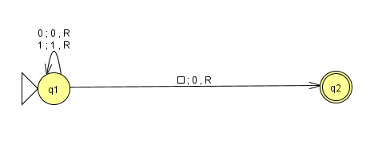
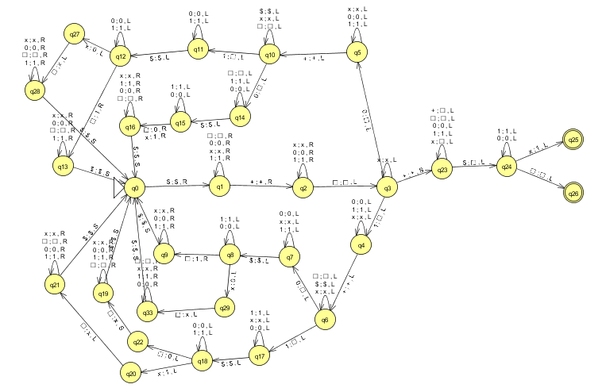
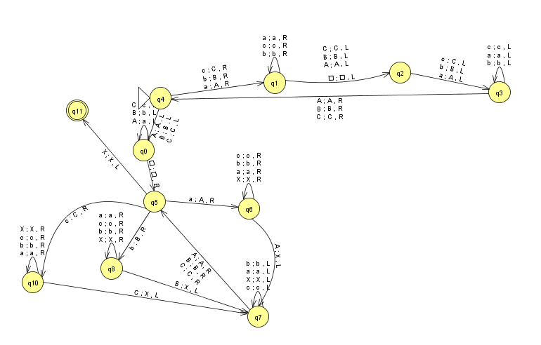

# Maquinas de Turing JFLAP

### Máquina de turing que recebe um número em binário e multiplica por dois
- Pode ser encontrada <a href= "https://github.com/Dionmax/MeusTrabalhos-UNIVALI-6p.CC/tree/master/AutomatosJFLAP/MutliplicacaoBinarioPor2JFLAP">nessa</a> pasta -> MutliplicacaoBinarioPor2JFLAP

###  Máquina de turing que recebe dois números em binário e da como saída a soma dos
###  dois números.
- Pode ser encontrada <a href= "https://github.com/Dionmax/MeusTrabalhos-UNIVALI-6p.CC/tree/master/AutomatosJFLAP/SomaBinariaJFLAP">nessa</a> pasta -> SomaBinariaJFLAP

###  Máquina de Turing que reconhece as palavras da seguinte linguagem: L = { ww | w ϵ {a, b, c} * }
- Pode ser encontrada <a href= "https://github.com/Dionmax/MeusTrabalhos-UNIVALI-6p.CC/tree/master/AutomatosJFLAP/ReconhecerConjuntoDePalavras">nessa</a> pasta -> ReconhecerConjuntoDePalavras

